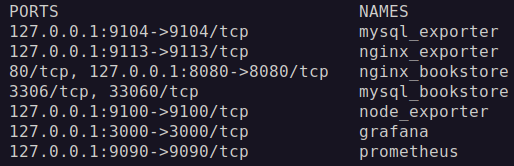
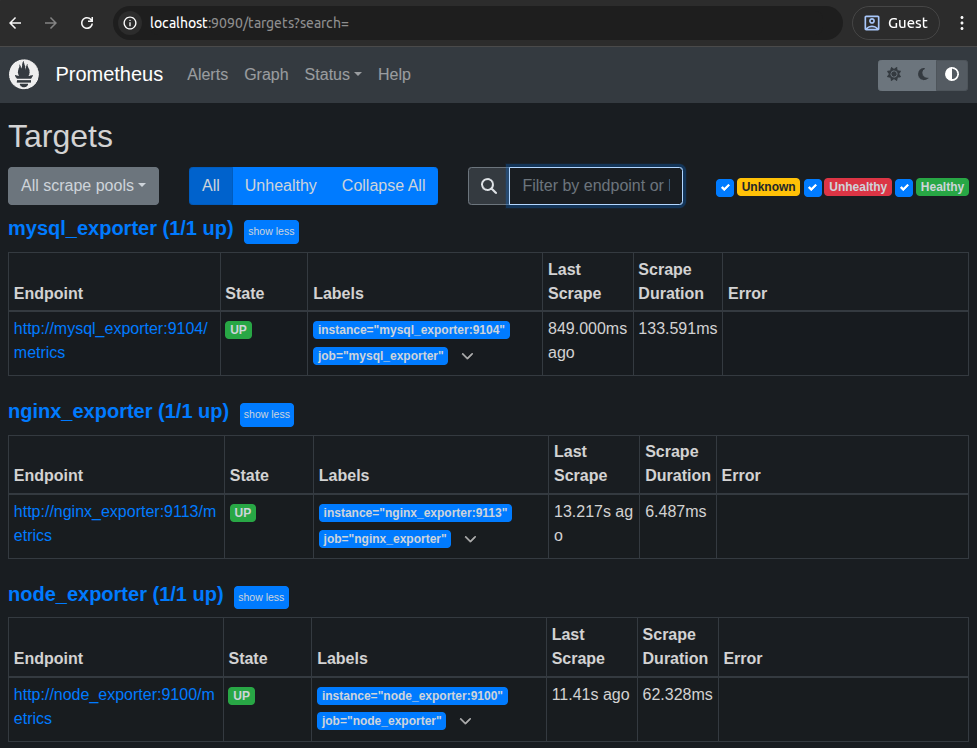
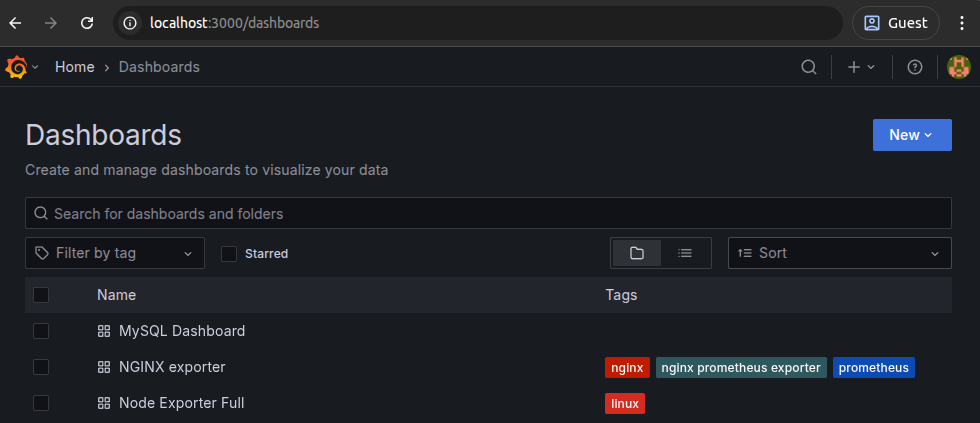
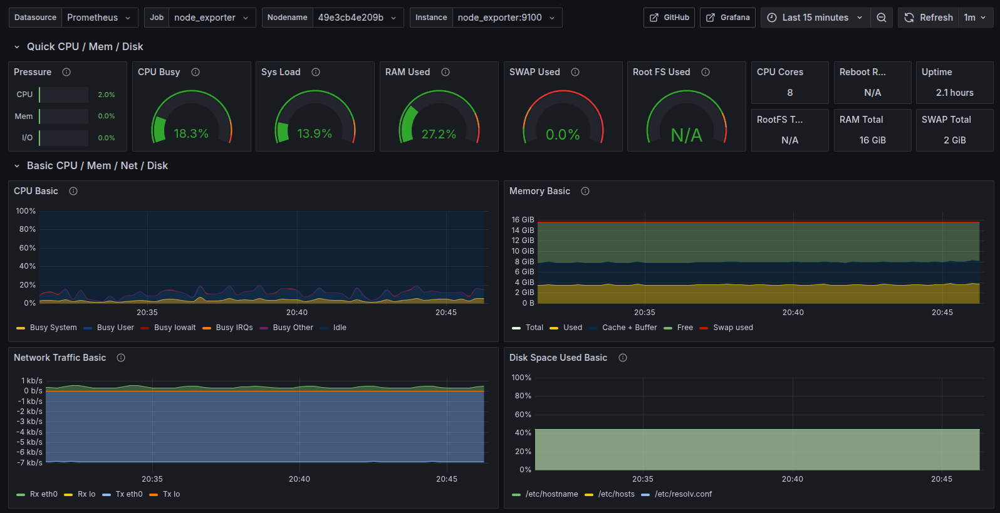
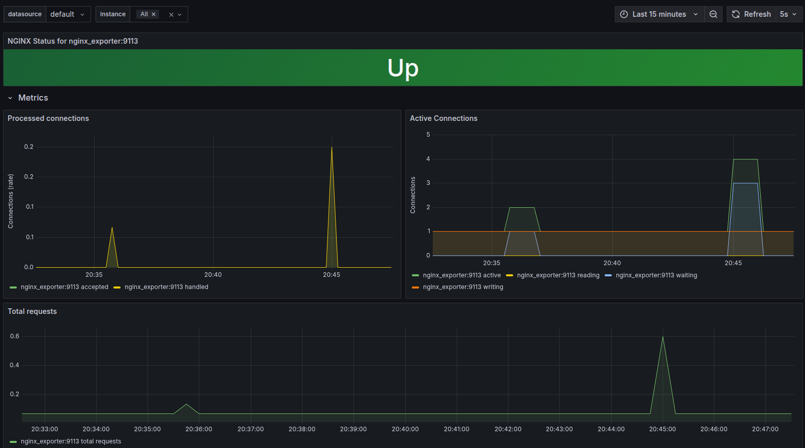
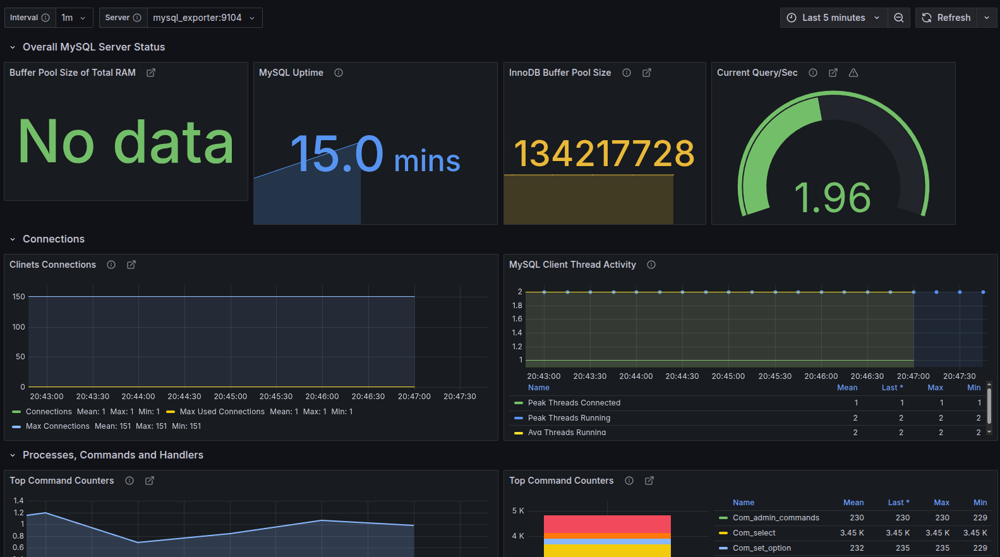

# Prometheus/Grafana bookstore monitoring

>Развёртывание системы мониторинга ресурсов хостовой машины, веб-сервера и базы данных для шаблонного сайта с помощью Docker Compose.

### Исходное приложение
В качестве приложения для мониторинга взят PHP/MySQL сайт, развёрнутый с помощью Docker в проекте [github.com/Qikxiji/PHP_MySQL_bookstore_deploy](https://github.com/Qikxiji/PHP_MySQL_bookstore_deploy)

### Стек мониторинга
- Prometheus - система мониторинга. Собирает метрики с Nginx, MySQL и хоста при помощи программ-экспортеров.
- Grafana - платформа визуализации данных. Использует Prometheus в качестве источника данных. Визуализирует метрики, собираемые и хранимые Prometheus в виде графиков, счётчиков, измерителей и др. 

## Структура проекта

```
$PROJECT_ROOT
│  
├── db  
│  ├── database.sql             # скрипт инициализации БД товаров и учётных данных пользователей
│  ├── Dockerfile               # файл сборки образа mysql, дополненный с помощью database.sql и exporter_user.sql
│  ├── exporter_user.sql        # скрипт создания пользователя для сбора метрик с mtsql
│  ├── root_password.sql        # файл с паролем для пользователя root, передается в виде docker secret
│  
├── grafana
│  ├── datasource.yml           # файл конфигурации источника данных
│  ├── grafana.db               # база данных с готовыми дашбордами для nginx, mysql и хоста
│  
├── nginx
│  ├── bookstore/               # директория с проектом сайта на php
│  ├── 5-php-fpm_entrypoint.sh  # скрипт запуска php-fpm, загружаемый в контейнер nginx
│  ├── Dockerfile               # файл сборки образа nginx, дополненный проектом сайта, php-fpm и файлами конфигурации nginx
│  ├── nginx.conf               # файл конфигурации виртуального сервера nginx
│  ├── php_site.conf            # файл глобальной конфигурации nginx
│
├── prometheus
│  ├── mysql_exporter_cnf       # файл конфигурации для mysql экспортера
│  ├── prometheus.yml           # файл конфигурации prometheus
│  
├── compose.yaml                # файл конфигурации и запуска сервисов nginx, mysql, prometheus, grafana, node_exporter, nginx_exporter, mysql_exporter
```
## Содержание проекта
1. В работу был принят проект развёртывания шаблонного сайта `github.com/Qikxiji/PHP_MySQL_bookstore_deploy`.
2. Полученный проект был дополнен системой мониторинга на основе Prometheus и Grafana. Выполнены следующие этапы проектирования:
 - Определены объекты мониторинга, ими стали: хостовая машина (мониторятся ресурсы ОЗУ, ЦПУ, диска, сети и т.д.), веб-сервер Nginx(состояние сервера, количество запросов м подключений), сервер MySQL (подключения, запросы, транзакции, нагрузка на сеть и др.).
 - Определены инструменты мониторинга: prometheus для централизованного хранения метрик, node exporter, nginx exporter и mysql exporter для сбора метрик, grafana для визуализации данных. 
 - В проект Docker Compose добавлены образы для запуска контейнеров Prometheus, Grafana, node exporter, nginx exporter и mysql exporter.
 -  Контейнеры подключены к сети контейнеров. Созданы именованные тома и тома bind mount для хранения данных контейнеров, а также загрузки файлов конфигураци в контейнеры. Переопределены параметры запуска контейнеров prometheus и nginx_exporter (для соответствия конфигурации), а также mysql_exporet (для раширения набора метрик).
 - Составлены файлы конфигурации prometheus (prometheus.yml), grafana (datasource.yml) и mysql_exporter (mysql_exporter_cnf).
 - Внесены изменения в конфигурационный файлы nginx (php_site.conf) для работы nginx_exporter, создан и загружен в образ mysql скрипт создания пользователя для подключения mysql_exporter к mysql.

## Требования для запуска
- Установить Docker, Compose обычно идет в комплекте.

## Запуск приложения

- Клонировать репозиторий 

```bash
git clone https://github.com/Qikxiji/... .
```  

- Перейдите в корневую папку приложения (с файлом compose.yaml), соберите и запустите приложение следующей командой: 
```bash
docker compose up -d
```
Загрузка и сборка всех образов (общий объем образов составляет 2073 Мб) и запуск контейнеров займет некоторое время.

После запуска откройте в браузере:
 - [localhost:8080](http://localhost:8080) ─ веб-сайт
 - [localhost:9090](http://localhost:9090) ─ prometheus
 - [localhost:3000](http://localhost:3000) ─ grafana (**login: admin password: grafana**, можно поменять в файле compose.yaml)


## Работа приложения
- Список контейнеров после запуска и проброса портов



- Основное окно сайта


- Окно целей скрейпирования prometheus [localhost:9090/targets](http://localhost:9090/targets)



- Окно выбора дашборда в Grafana [localhost:3000/dashboards](http://localhost:3000/dashboards)



- Дашборд мониторинга ресурсов хостовой машины



- Дашборд мониторинга веб-сервера Nginx



- Дашборд мониторинга MySQL сервера


